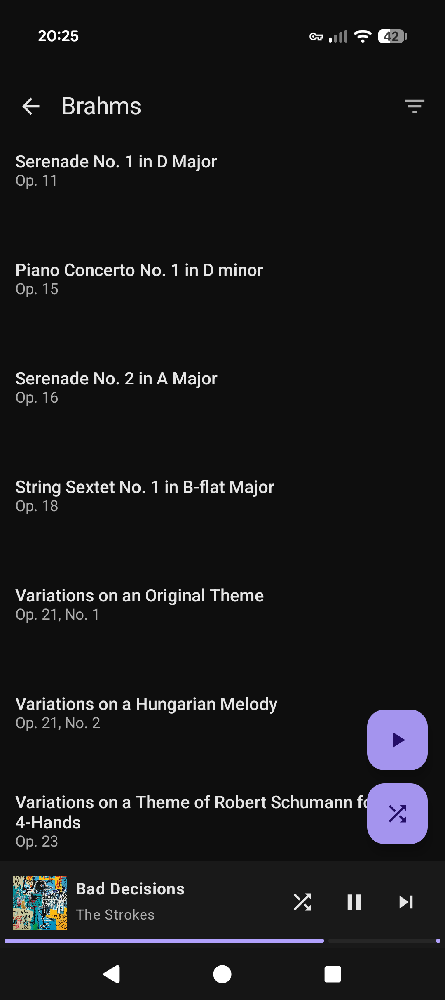
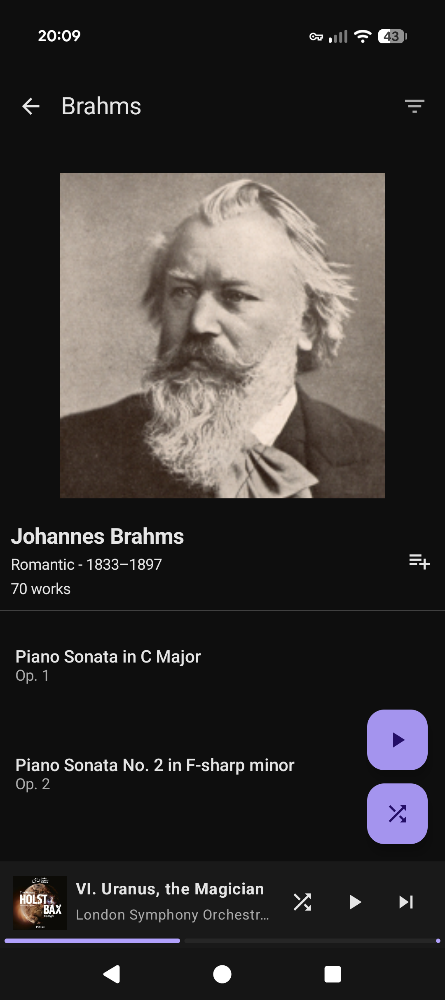
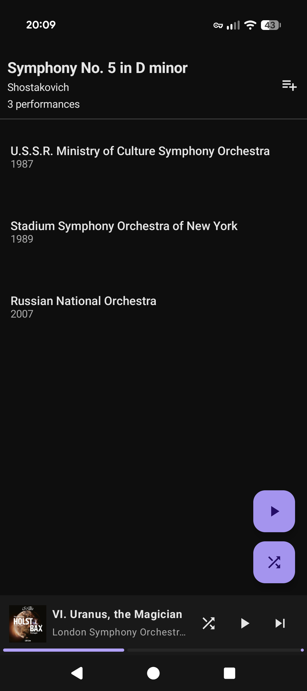
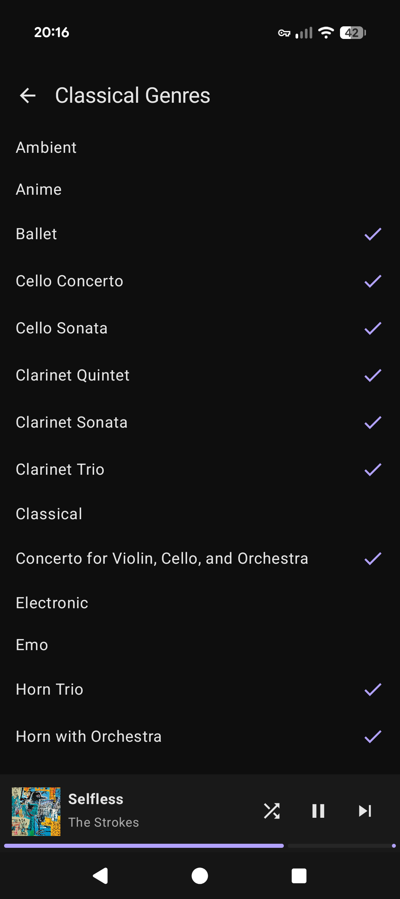
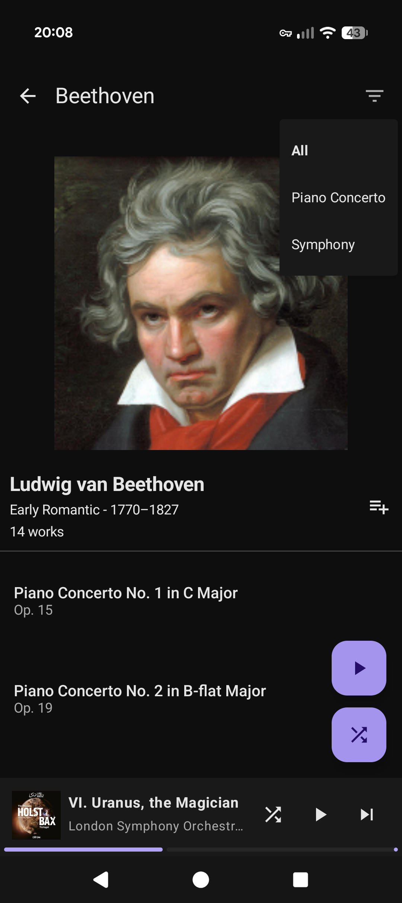
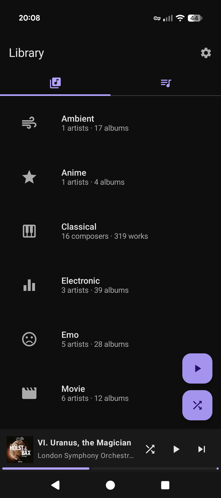
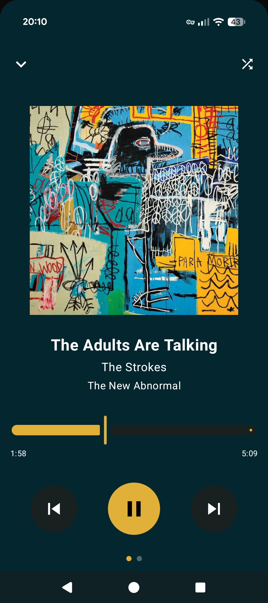
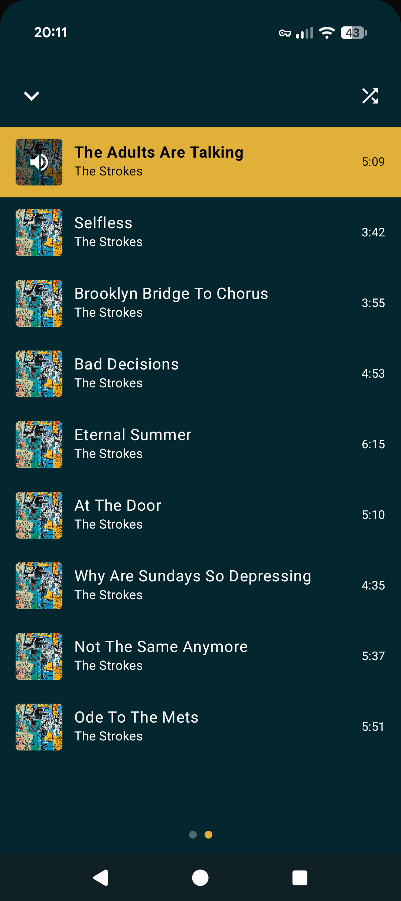
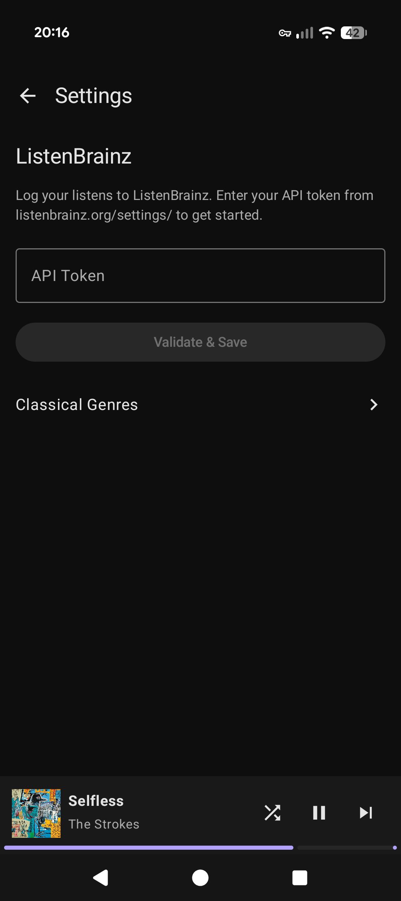

# What does this app do?
This is a local music player app designed to deal with large, varied music libraries.
It has a specific focus on making classical music easier to organize and access on the go.
# Features
## Classical Focus
- **Catalog Numbers** - Opus numbers, Köchel numbers (K.), Bach-Werke-Verzeichnis (BWV), and others are parsed from track metadata and used for sorting, so works appear in their correct compositional order.

- **Composer metadata** - Composer names are looked up against the **OpenOpus API** to retrieve birth/death dates, musical epoch (Baroque, Classical, Romantic, etc.), and a portrait photo to give more context when browsing through your classical library.

- **Performances, not just albums** - The same piece (e.g. Beethoven's Fifth) often has many recordings by various orchestras and conductors. This app treats those as distinct **performances** so you can browse different performances of the same piece rather than having them collapse into a single album entry.

- **Hierarchical genres** - Since Classical music doesn't fit neatly into the usual artist/album/track model, this app allows you to choose sub-genres like Symphony, Piano Concert, String Quartet, etc. that will be grouped underneath "Classical" for easy access.

- **Sub-genre filtering** - When viewing works by a composer, you can filter down those works by sub-genre, allowing you to quickly jump to a certain type of work without having to comb through a composer's whole catalog.

## Genre-first Library
To support large, varied libraries, the app starts with Genre, then drills down through artists -> albums -> tracks.
This lets you narrow your choices down before picking a specific artist or album to listen to.

## Now Playing
A mini player sits at the bottom of every screen, and shows the currently playing track.

Expanding it opens a full-screen player that gives you more information about the track, and provides more controls. The full-screen player adjusts it colors based on the artwork of the currently playing track.

Swiping to the right reveals a queue of the tracks that are currently playing, and you can tap any track to jump directly to it.

Now playing state is kept in sync with Android's Media3 session, so player controls also work from the lock screen and notification shade.

## Scrobbling
The app supports scrobbling listens to [ListenBrainz](https://listenbrainz.org/).

## Playlists
Any entity you see in the app - a genre, artist, album, or track - can be long pressed and added to a playlist.
Adding a genre adds every track in that genre, adding an album adds all of its tracks, and so on.
You can create new playlists inline without leaving the screen that you're currently on.

## Android Auto
This app has support for Android Auto, maintaining the genre-first structure in the Auto interface, including the Classical grouping.

# Technical Details
This app was built using [Kotlin](https://kotlinlang.org/) and [Jetpack Compose](https://developer.android.com/compose).

## Libraries Used
[Media3 ExoPlayer](https://developer.android.com/media/media3/exoplayer) for playing music files and handling playback state.
 
[Coil](https://github.com/coil-kt/coil) for loading and displaying images.
 
[Palette API](https://developer.android.com/develop/ui/views/graphics/palette-colors) for extracting colors from album artwork.
 
[Room](https://developer.android.com/training/data-storage/room/) for storing the user's library metadata locally.
 
[Retrofit 2](https://github.com/square/retrofit) for making type-safe HTTP API calls.
 
[Mediastore](https://developer.android.com/reference/android/provider/MediaStore) for reading local music files.

## External APIs
[Open Opus](https://openopus.org/) for looking up information about classical composers.
 
[TheAudioDB](https://www.theaudiodb.com/free_music_api) for looking up information about non-classical artists.
 
[ListenBrainz](https://listenbrainz.readthedocs.io/en/latest/users/api/index.html) for scrobbling listens.

